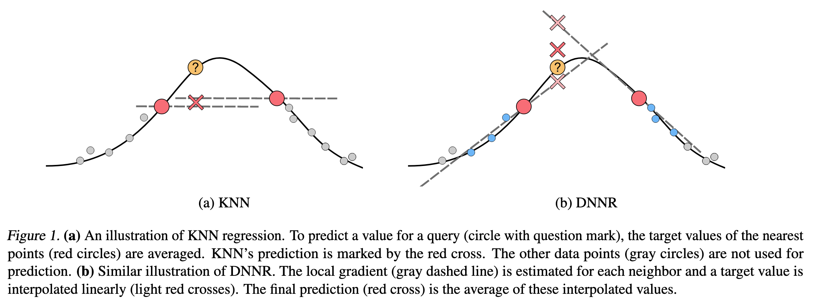

# DNNR: Differential Nearest Neighbors Regression

[](https://github.com/younader/dnnr/actions/workflows/dev.yml)

[[Paper](https://proceedings.mlr.press/v162/nader22a.html)]
[[Documentation](https://younader.github.io/dnnr/)]

The Python package of [differential nearest neighbors regression (DNNR)](https://proceedings.mlr.press/v162/nader22a.html): **Raising KNN-regression to levels of gradient boosting methods.**

Whereas KNN regression only uses the averaged value, DNNR also uses the gradient or even higher-order derivatives:



Our implementation uses `numpy`, `sklearn`, and the [`annoy`](https://github.com/spotify/annoy) approximate nearest neighbor index. Using `annoy` is optional, as you can also use `sklearn`'s KDTree as index. We support Python 3.7 to 3.10.


# 🚀 Quickstart


To install this project, run:

```bash
pip install dnnr
```


# 🎉 Example

```python
import numpy as np
from dnnr import DNNR

X = np.array([[0], [1], [2], [3]])
y = np.array([0, 0, 1, 1])

model = DNNR(n_neighbors=1, n_derivative_neighbors=3)
model.fit(X, y)
model.predict([[1.5]])
# Will output: 0.25
```

Also check out our [Jupiter Notebook](./examples/dnnr_tutorial.ipynb) on how to use DNNR. [](https://colab.research.google.com/github/younader/dnnr/blob/main/examples/dnnr_tutorial.ipynb)


# 📊 Hyperparameters

DNNR has three main hyperparameters:

* `n_neighbors`: number of nearest neighbors to use. The default value of
      `3` is usually a good choice.
* `n_derivative_neighbors`: number of neighbors used in approximating the
      derivatives. As a default value, we choose `3 * dim`, where `dim` is
      the input dimension.
* `order`: Taylor approximation order, one of `1`, `2`, `2diag`, `3diag`.
      The preferable option here is `1`. Sometimes `2diag` can deliver
      small improvements. `2` and `3diag` are implemented but usually do
      not yield significant improvements.

We recommend a hyperparameter search over the `n_derivative_neighbors` variable to archive the best performance.

For all options, see the [documentation of the DNNR class](https://younader.github.io/dnnr/api/#dnnr.dnnr.DNNR).

#  🛠 Development Installation

```bash
python3 -m venv venv      # create a virtual environment
source venv/bin/activate  # and load it
git clone https://github.com/younader/dnnr.git
cd dnnr
pip install -U pip wheel poetry
poetry install
make test                 # to run the tests
```


# 📄 Citation

If you use this library for a scientific publication, please use the following BibTex entry to cite our work:

```bibtex
@InProceedings{pmlr-v162-nader22a,
  title = 	 {{DNNR}: Differential Nearest Neighbors Regression},
  author =       {Nader, Youssef and Sixt, Leon and Landgraf, Tim},
  booktitle = 	 {Proceedings of the 39th International Conference on Machine Learning},
  pages = 	 {16296--16317},
  year = 	 {2022},
  editor = 	 {Chaudhuri, Kamalika and Jegelka, Stefanie and Song, Le and Szepesvari, Csaba and Niu, Gang and Sabato, Sivan},
  volume = 	 {162},
  series = 	 {Proceedings of Machine Learning Research},
  month = 	 {17--23 Jul},
  publisher =    {PMLR},
  pdf = 	 {https://proceedings.mlr.press/v162/nader22a/nader22a.pdf},
  url = 	 {https://proceedings.mlr.press/v162/nader22a.html},
}
```
